 

 

## 👋 About Me

I'm a **backend-first Full-Stack Engineer** who loves designing systems that scale cleanly from the database up. My core strength is the **.NET ecosystem** — building secure, well-architected REST APIs — paired with the ability to ship a polished Angular frontend on top when the project needs one.

- 🔧 Design & build **scalable REST APIs** using ASP.NET Core & EF Core
- 🔐 Experienced with **authentication, authorization & clean architecture**
- 🎨 Build responsive **Angular UIs** tightly integrated with backend services
- ☁️ Actively growing in **Azure, CI/CD pipelines & system design**
- 📈 Comfortable owning a project **end-to-end** — from schema design to deployment

 

## 🧩 Tech Stack

**Languages**
 

  

**Frontend**
 

  

**Backend & Frameworks**
 

  

**Databases**
 

  

**Cloud & DevOps**
 

  

**Tools**
 

 

## 🏆 Professional Highlights

- 🚀 Designed **production-grade REST APIs** with role-based access control
- 🏗️ Built scalable backend systems using **.NET, EF Core & SQL Server**
- 🔗 Delivered **end-to-end full-stack applications** from database to UI
- ⚡ Optimized large-data workflows while keeping the UI responsive
- 🧭 Comfortable owning **backend, frontend & deployment pipelines** solo

 

## 🌱 Currently Focused On

- Deepening **system design** & distributed backend patterns
- Hands-on with **Azure App Services, Functions & DevOps pipelines**
- Sharpening **clean architecture & testing practices** in .NET

 

## 📊 GitHub Stats

 

> 💡 **Note:** These images are generated once a day by a GitHub Action (`.github/workflows/update-stats.yml`) and committed into `/assets`, so they load instantly from this repo instead of depending on a live third-party server.

 

## 📫 Portfolio & Contact

 

